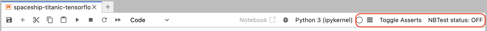

# NBTest - Automated Assertion Generation for Machine Learning Notebooks

## Part 1: What is NBTest?

**NBTest** is an automated assertion generation tool designed specifically for **machine learning notebooks**. It identifies ML-specific metrics (e.g., dataset statistics, model performance) and generates **statistically robust assertions** to help you catch subtle regressions and inconsistencies that previous tools like [`nbval`](https://github.com/computationalmodelling/nbval) may miss.

NBTest includes three main components:

1. **`nbtest-gen`**: A CLI tool that analyzes a Jupyter notebook and automatically generates ML-related assertions.
2. **`nbtest-plugin`**: A custom Pytest plugin that executes assertions embedded in `.ipynb` files.
3. **`nbtest-lab-extension`**: A JupyterLab extension to toggle assertion checking interactively during notebook development.

You can toggle assertions on or off depending on your workflow:

* **During development**, keep assertions off to avoid interruption.
* **After development**, enable assertions to verify consistency with previous runs.

---

## Part 2: Installation

Install all components from TestPyPI using:

```bash
pip install --extra-index-url https://test.pypi.org/simple/ nbtest-plugin
pip install --extra-index-url https://test.pypi.org/simple/ nbtest-gen
pip install --extra-index-url https://test.pypi.org/simple/ nbtest-lab-extension
```

---

## Part 3: Quick Start

### 1. Generate Assertions

```bash
nbtest-gen <notebook_path> -n <num_iterations> -o <output_dir>
```

* `notebook_path`: Path to the `.ipynb` file.
* `num_iterations`: Number of times the notebook is run to collect statistics (suggested: 10-30).
* `output_dir`: Output directory for logs and the assertion-augmented notebook.

**Example:**

```bash
nbtest-gen ./spaceship-titanic.ipynb -n 10 -o ./outputs
```

The generated notebook will be:

```
./outputs/spaceship-titanic_chebyshev_0.95_10.ipynb
```

### 2. Run Assertions via Pytest

```bash
pytest -v --nbtest <notebook_with_assertions>
```

**Example:**

```bash
pytest -v --nbtest ./outputs/spaceship-titanic_chebyshev_0.95_10.ipynb
```

### 3. Toggle Assertions in JupyterLab

Launch the notebook:

```bash
jupyter-lab ./outputs/spaceship-titanic_chebyshev_0.95_10.ipynb
```

Use the **Toggle Asserts** button to switch **NBTest status: ON/OFF** in the top-right corner.

* `NBTest status: OFF` — Assertions will be ignored during execution.
* `NBTest status: ON` — Assertions are enforced during cell execution.




### 4. Custom Assertions

You can add assertions manually using `nbtest`. Supported types include:

#### General Assertions

* `assert_equal(a, b, err_msg='', type='', test_id='')`
    * `a`, `b`: Values to compare.
    * `err_msg`: Optional error message.
    * `type`, `test_id`: Optional metadata.
    * Example: `nbtest.assert_equal([1, 2, 3], [1, 2, 3])`
* `assert_allclose(a, b, rtol=1e-07, atol=0, err_msg='', type='', test_id='')`
    * `a`, `b`: Numeric values or arrays to compare.
    * `rtol`, `atol`: Relative and absolute tolerance.
    * `err_msg`, `type`, `test_id`: Optional metadata.
    * Example: `nbtest.assert_allclose(np.array([0.1, 0.2]), np.array([0.1, 0.20000001]), rtol=1e-5)`

* `assert_true(a, msg=None, type='', test_id='')`
    * Example: `nbtest.assert_true(3 > 1)`

* `assert_false(a, msg=None, type='', test_id='')`:
    * Example: `nbtest.assert_false(1 > 3)`

#### DataFrame-Specific Assertions

* `assert_nanvar(a, b, rtol=1e-07, atol=0, err_msg='', test_id='')`
    * Assert that the variance of numeric columns in a DataFrame matches expected values (ignoring NaNs).
    * `a`: Pandas DataFrame.
    * `b`: Expected variance value or array.
    * Example: `nbtest.assert_nanvar(df, expected_var)`

* `assert_nanmean(a, b, rtol=1e-07, atol=0, err_msg='', test_id='')`
    * Assert that the mean of numeric columns in a DataFrame matches expected values (ignoring NaNs).
    * `a`: Pandas DataFrame.
    * `b`: Expected mean value or array.
    * Example: `nbtest.assert_nanmean(df, expected_mean)`

* `assert_column_types(a, b, err_msg='', test_id='')`
    * Assert that column data types match the expected list.
    * `a`: Pandas DataFrame.
    * `b`: List of expected data type strings.
    * Example: `nbtest.assert_column_types(df, ['int64', 'float64', 'object'])`

* `assert_column_names(a, b, err_msg='', test_id='')`
    * Assert that column names match the expected list.
    * `a`: Pandas DataFrame.
    * `b`: List of expected column names (sorted).
    * Example: `nbtest.assert_column_names(df, ['age', 'height', 'weight'])`


---

## Part 4: Example Walkthrough

In this section, we walk through a real-world example using NBTest on a Kaggle notebook. (No GPU required!)

We'll use the notebook at `./nbtest_demo/house-prices-advanced-regression-techniques.ipynb`.

### Step 1: Set up the Conda Environment


```bash
cd nbtest_demo
conda env create -f ./environment.yml
conda activate nbtest_demo
```
`nbtest_demo` environment includes all required packages (i.e., `nbtest-gen`, `nbtest-plugin`, and `nbtest-lab-extension`).

Test the notebook to ensure it executes without error:

```bash
jupyter execute ./house-prices-advanced-regression-techniques.ipynb --output=./house-prices-advanced-regression-techniques_output.ipynb
```

### Step 2: Use NBTest to Generate Assertions

Run the following command:

```bash
nbtest-gen ./house-prices-advanced-regression-techniques.ipynb -n 10 -o ./outputs
```

It may take around 10 minutes—go grab a coffee ☕.

After completion, your new notebook will be located at:

```
./outputs/house-prices-advanced-regression-techniques_chebyshev_0.95_10.ipynb
```

### Step 3: Run Assertions via Pytest

Check if the current notebook passes the generated assertions:

```bash
pytest -v --nbtest ./outputs/house-prices-advanced-regression-techniques_chebyshev_0.95_10.ipynb
```

You should see something like this in the terminal output, indicating all assertions passed.
```sh
============================= test session starts ==============================
platform linux -- Python 3.9.22, pytest-8.3.5, pluggy-1.6.0 -- /home/usr/bin/python3.9
cachedir: .pytest_cache
rootdir: /home/user/
configfile: pyproject.toml
plugins: anyio-4.9.0, nbtest_plugin-0.1.6
collecting ... collected 62 items

outputs/house-prices-advanced-regression-techniques_chebyshev_0.95_10.ipynb::4 PASSED [  1%]
outputs/house-prices-advanced-regression-techniques_chebyshev_0.95_10.ipynb::3 PASSED [  3%]
outputs/house-prices-advanced-regression-techniques_chebyshev_0.95_10.ipynb::2 PASSED [  4%]
...
outputs/house-prices-advanced-regression-techniques_chebyshev_0.95_10.ipynb::61 PASSED [100%]

============================= 62 passed in 43.67s ==============================

```

### Step 4: Interact with Assertions in JupyterLab

Want to debug in real time? Launch the notebook with:

```bash
jupyter-lab ./outputs/house-prices-advanced-regression-techniques_chebyshev_0.95_10.ipynb
```

In the top-right corner, you’ll see:

* **Toggle Asserts** icon
* **NBTest status: ON/OFF** indicator


Set **NBTest status: ON**. Now assertions will execute as part of cell execution.

Try running the first 3 cells:

```python
train_df = pd.read_csv('./input/train.csv')
nbtest.assert_nanvar(train_df, np.float64(1010233951.9129187), atol=np.float64(5.331201499700043e-07), test_id='4')
nbtest.assert_nanmean(train_df, np.float64(5457.877675397229), atol=np.float64(0.0), test_id='3')
nbtest.assert_column_types(train_df, ['int64', ... 'int64'], test_id='2')
nbtest.assert_column_names(train_df, ['1stFlrSF', ... 'YrSold'], test_id='1')
nbtest.assert_equal(train_df.shape, (1460, 81), test_id='0')
```

They should all pass—unless you've made unintended changes.

### Step 5: What If You Introduce Bugs?

Suppose we modify the notebook and mistakenly drop a row:

```python
train_df = pd.read_csv('./input/train.csv')
train_df = train_df.drop(index=1)
nbtest.assert_nanvar(train_df, np.float64(1010233951.9129187), atol=np.float64(5.331201499700043e-07), test_id='4')
```

Now rerun the cell. NBTest will catch this discrepancy immediately. This is particularly useful for debugging pipelines or validating preprocessing logic.

### Step 6: Catching Subtle Bugs in Model Performance

NBTest also checks model metrics. For example:

```python
nbtest_tmpvar_18 = r2_score(y_test, y_pred)
nbtest.assert_allclose(nbtest_tmpvar_18, np.float64(0.8208617481485916), atol=np.float64(0.3493966396957795), test_id='61')
```

Even slight regressions in prediction performance can be flagged early using such assertions.

### Step 7: Add Manual Assertions (Optional)

You can insert custom assertions directly:

```python
import nbtest
import math
nbtest.assert_equal(round(math.pi, 2), 3.14)
nbtest.assert_true(math.pi == 3)  # This will fail
```

When you execute this with assertions **OFF**, nothing happens. 
```
jupyter execute ./outputs/house-prices-advanced-regression-techniques_chebyshev_0.95_10.ipynb --output=./outputs/house-prices-advanced-regression-techniques_chebyshev_0.95_10_customized_assertions.ipynb
```

When assertions are **ON** (i.e., running using pytest):

```bash
pytest -v --nbtest ./outputs/house-prices-advanced-regression-techniques_chebyshev_0.95_10.ipynb
```

You'll see the failure logged clearly—just like a standard Pytest assertion.


## Part 5: Types of Auto-Generated Assertions

NBTest can generate:

### 1. Dataset-Based Assertions

Checks related to dataset structure, variance, means, column types/names, shape.
Example:
```python
train_df = pd.read_csv('./input/train.csv')
nbtest.assert_nanvar(train_df, np.float64(1010233951.9129187), atol=np.float64(5.331201499700043e-07), test_id='4')
nbtest.assert_nanmean(train_df, np.float64(5457.877675397229), atol=np.float64(0.0), test_id='3')
nbtest.assert_column_types(train_df, ['int64', ..., 'int64'], test_id='2')
nbtest.assert_column_names(train_df, ['1stFlrSF', ..., 'YrSold'], test_id='1')
nbtest.assert_equal(train_df.shape, (1460, 81), test_id='0')
```

### 2. Model Architecture Assertions

Ensures model configurations match expectations.

Example:
```python
regressor = RandomForestRegressor(n_estimators=10, random_state=0)
nbtest.assert_equal({k: v for k, v in regressor.get_params().items() if k != 'random_state' and not (hasattr(v, '__module__') and v.__module__.startswith('sklearn'))}, {'bootstrap': True, 'ccp_alpha': 0.0, 'criterion': 'squared_error', 'max_depth': None, 'max_features': 1.0, 'max_leaf_nodes': None, 'max_samples': None, 'min_impurity_decrease': 0.0, 'min_samples_leaf': 1, 'min_samples_split': 2, 'min_weight_fraction_leaf': 0.0, 'monotonic_cst': None, 'n_estimators': 10, 'n_jobs': None, 'oob_score': False, 'verbose': 0, 'warm_start': False}, test_id='59')

```

### 3. Model Performance Assertions

Verifies key performance metrics like accuracy, R^2, loss, etc.

Example:
```python
nbtest.assert_allclose(r2_score(y_test, y_pred), 0.82, atol=0.35)
```

---

## License

This project is licensed under the MIT License.

## Contact

Questions or feedback? Reach out to Elaine Yao [yy2282@cornell.edu]

---

**Happy Testing!**
